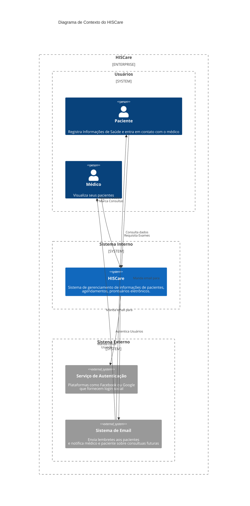

```mermaid
      C4Context
    title Diagrama de Contexto do HISCare

    Enterprise_Boundary(b0, "HISCare"){

        System_Boundary(b1, "Usuários"){
            Person(paciente, "Paciente", "Registra Informações de Saúde e entra em contato com o médico")
            Person(medico, "Médico", "Visualiza seus pacientes")
        }
        System_Boundary(b2, "Sistema Interno") {
            System(hiscare,"HISCare", "Sistema de gerenciamento de informações de pacientes,<br> agendamentos, prontuários eletrônicos.")
        }

        System_Boundary(b3, "Sistena Externo"){
            System_Ext(auth, "Serviço de Autenticação", "Plataformas como Facebook ou Google <br/> que fornecem login social")
            System_Ext(email, "Sistema de Email", "Envia lembretes aos pacientes <br> e notifica médico e paciente sobre consultuas futuras")
        }
    }  

    Rel(paciente, hiscare, "Registra Dados <br> e Marca Consultas")
    Rel(medico, hiscare, "Consulta dados <br> Requisita Exames")
    Rel(hiscare, auth, "Autentica Usuários")
    Rel(hiscare, email, "Manda Email <br>Usando")
    Rel(email,paciente,"Manda email para")
    Rel(email,medico,"Manda email para")

    UpdateLayoutConfig($c4ShapeInRow="8", $c4BoundaryInRow="1")
    UpdateRelStyle(paciente, hiscare, $offsetY="-10", $offsetX="-110")
    UpdateRelStyle(medico, hiscare, $offsetY="0", $offsetX="50")
    UpdateRelStyle("hiscare", "email", $offsetY="-50", $offsetX="-85")
    UpdateRelStyle("email", "paciente", $offsetY="0", $offsetX="45")

```